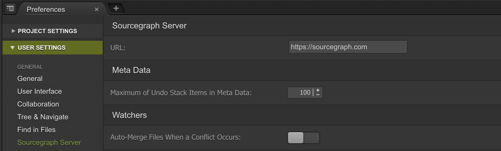

# Sourcegraph for Cloud9

The Sourcegraph plugin for Cloud9 editor let's you quickly open and search code on Sourcegraph.com or your Sourcegraph Server instance easily and efficiently.

## Installation

To load a plugin open your *Init Script* from Cloud9 > Open Your Init Script menu.
And add code like this:

```
// check that this is the workspace you want to use
if (services.c9.workspaceId.match("{username}/{workspacename}")) {
    // call plugin manager with a list of plugins you want to load
    // this takes either url, or a path on your vm
    services.pluginManager.loadPackage([
        "https://cdn.rawgit.com/sourcegraph/sourcegraph-c9/v0.0.2/sourcegraph/c9build/package.sourcegraph.js",
    ])
}
```

## Usage

In the command palette (<kbd>Cmd+.</kbd>), search for `sourcegraph` to see available actions.

Keyboard Shortcuts:

| Description                     | Mac                 | Linux / Windows  |
|---------------------------------|---------------------|------------------|
| Open file in Sourcegraph        | <kbd>Option+O</kbd> | <kbd>Alt+O</kbd> |
| Search selection in Sourcegraph | <kbd>Option+S</kbd> | <kbd>Alt+S</kbd> |

You can customize these keybindings in the preferences menu (<kbd>Cmd+,</kbd>)

## Settings

- Open `Cloud9` -> `Preferences` (<kbd>Cmd+,</kbd>)
- User Settings
- Sourcegraph Server
- Set the URL to your Sourcegraph Server instance or leave as the default Sourcegraph.com value.


